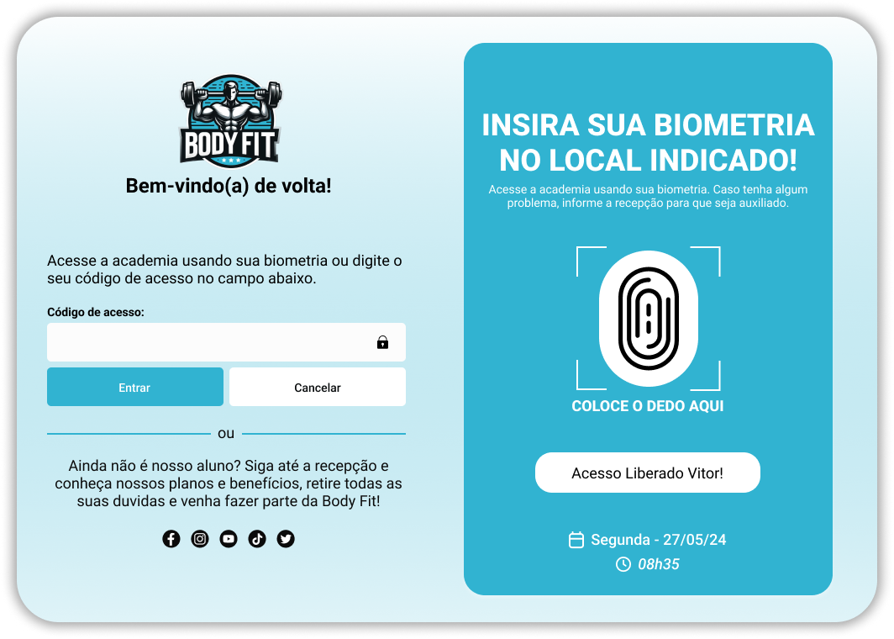

# Body Fit

Este projeto é uma interface de acesso para a academia Body Fit, permitindo o login através de biometria ou código de acesso. Ele também inclui uma interface para visualização de registros de entrada e saída dos usuários.

## Índice

- [Visão Geral](#visão-geral)
- [Funcionalidades](#funcionalidades)
- [Interface do Usuário](#interface-do-usuário-lado-cliente)
- [Interface de Registro](#interface-de-registro-lado-servidor)
- [Instalação](#instalação)
- [Uso](#uso)
- [Códigos de Acesso](#códigos-de-acesso)
- [Estrutura de Arquivos](#estrutura-de-arquivos)
- [Tecnologias Utilizadas](#tecnologias-utilizadas)
- [Colaboradores](#colaboradores)
- [Resumo Final](#resumo-final)


## Visão Geral

A interface principal oferece aos usuários a opção de acessar a academia usando biometria ou código de acesso. Além disso, uma tabela exibe os registros de entrada e saída dos usuários, com a opção de resetar esses registros.

## Interface do Usuário (Lado cliente)



## interface de Registro (Lado servidor)


## Resetar registro (Lado servidor)


## Funcionalidades

- Login usando biometria.
- Login usando código de acesso.
- Exibição de registros de entrada e saída.
- Reset dos registros de entrada e saída.
- Visualização da data e hora atuais.
- Links para redes sociais da academia.

## Instalação

1. Clone o repositório:

    ```sh
    git clone https://github.com/seu-usuario/seu-repositorio.git
    ```

2. Navegue até o diretório do projeto:

    ```sh
    cd seu-repositorio
    ```

3. Abra o arquivo `index.html` em seu navegador preferido.

## Uso

1. Abra o arquivo `username.html` e `records.html` em um navegador da web.
2. Para login, insira seu código de acesso ou utilize a biometria.
3. Veja os registros de entrada e saída na tabela disponível.
4. Utilize o botão de reset para limpar os registros, se necessário.

## códigos de Acesso

        'code1':'Vitor Ribeiro',
        'code2': 'Letícia Barreto',
        'code3': 'Enrique Lopes',
        'code4': 'Thiago Negreiros',
        'code5': 'Gabriel Fonseca',
        'code6': 'Guilherme Gomes',
        'code7': 'Diego Dias',
        'code8': 'Beatriz Santos',
        'code9': 'Murilo Souza',
        'code10': 'Samuel Martins',
        'code11': 'Gabrielly Araujo',
        'code12': 'Rafael Lima',
        'code13': 'Anna Lima',
        'code14': 'Nicolas Souza',
        'code15': 'Luis Oliveira',
        'code16': 'João Rodrigues',
        'code17': 'Felipe Gomes',
        'code18': 'Igor Dias',
        'code19': 'Antônio Oliveira',
        'code20': 'Marisa Carvalho',

## Estrutura de Arquivos

- img/
  - body-fit-favicon.ico
  - body-fit-logo-sem-fundo.png
  - biometria.png
  - cadeado.png
  - data.png
  - hora.png
  - listra-azul.png
  - reset.png
  - resetar-registro.png
  - tela-do-usuario-body-fit.png
  - tela-e-registros-body-fit.png
- icons/
  - facebook.png
  - instagram.png
  - tiktok.png
  - twitter.png
  - youtube.png
  - github-icon.svg
- styles/
  - username_style.css
  - records_style.css
- scripts/
  - username_script.js
  - records_script.js
- index.html
- README.md


## Tecnologias Utilizadas

- HTML
- CSS
- JavaScript

## Colaboradores

 - [Guilherme Bezerra](https://github.com/Roosip)

 - [Vitor Ribeiro](https://github.com/vitorribeiro97)

 - [Enrique lopes](https://github.com/enriquz)

 - [Thiago Negreiros](https://github.com/thithi22)


## Resumo Final

Este é um projeto em desenvolvimento, foi concebido e executado por nós, enquanto colaboradores e fundadores, para atender aos propósitos acadêmicos do curso de Ciência da Computação 1° Semestre, em conformidade com os preceitos estabelecidos pela Constituição Federal Brasileira. Em conformidade com o Artigo 5º, inciso XXVII, da Constituição, esclarecemos que sua finalidade é estritamente educacional e sem fins lucrativos. De acordo com o Artigo 5º, inciso XXVIII, é expressamente vedada a reprodução deste projeto para fins lucrativos e ilícitos. Qualquer utilização contrária aos princípios constitucionais será passível das medidas legais cabíveis.